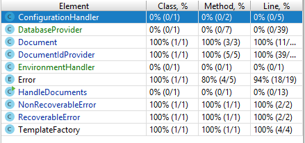

# Changes made to the code

1. Cambiada estructura modular, la clase Document recibe en su constructor la clases auxiliares encargada de obtener los ids de la base de datos y las variables de entorno. Se han eliminado los setters por utilidad, se recibe la información en el constructor.

2. La clase DocumentIdProvider no es necesario que sea singleton, se creará una instancia de la misma cada ve que ejecute la aplicación.

3. Se ha separado la parte de base de datos en la clase DatabaseProvider y la función encargada de obtener una variable de entorno dentro de la clase EnvironmetnHandler. Esto no es estrictamente necesario pero a la hora de realizar mocking es mucho más cómodo al ser estas incluidas en el constructor de la clase.

4. Se utiliza mockito para poder mockear objetos complejos y establecer un comportamiento determinado.

5. Se aportan test para la clase Docuent y DocumentIdProvider co cobertura de cósigo del 100%. (El resto de test no se han realizado ya que no se pedían para la actividad).

